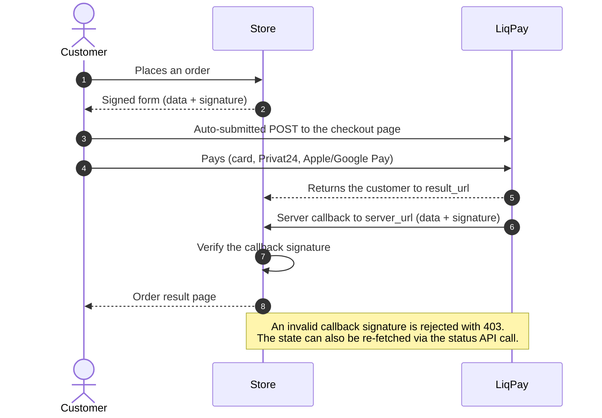
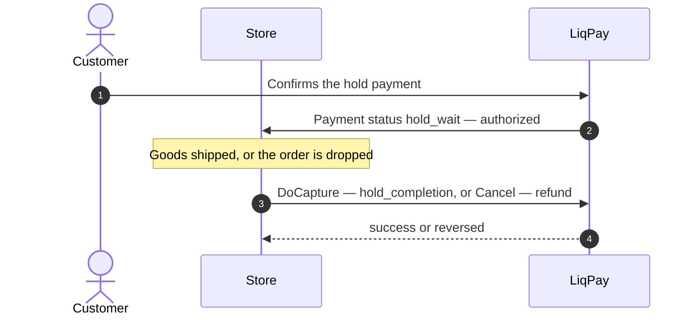

# Payum LiqPay

Provides [LiqPay](https://www.liqpay.ua/) integration for
[Payum](https://github.com/Payum/Payum) with two gateway factories:

- **`liqpay_checkout`** — hosted checkout: the customer is sent to the LiqPay
  payment page with a signed auto-submitted form.
- **`liqpay_widget`** — embedded widget: the LiqPay JS widget
  (`static.liqpay.ua/libjs/checkout.js`) is rendered inside the store page.

Supported operations:

- `Capture` — build the signed `data`/`signature` payload and hand the
  customer over to LiqPay (redirect form or embedded widget).
- `Authorize` — same flow with `action=hold`: the funds are locked and the
  store settles the payment later.
- `DoCapture` (the shared request from `sol-parts/payum-contracts`, when
  installed) — settle a held payment via the `hold_completion` API call.
- `Cancel` — reversal of a held payment through the `refund` API call; for a
  not-yet-paid checkout it is a no-op (the invoice expires on its own).
- `Refund` — refund of a captured payment (`refund` API call with an explicit
  `amount`).
- `Notify` — the callback signature is verified before the payload is applied;
  an invalid signature is rejected with `403`.
- `GetStatus` — maps LiqPay statuses to Payum ones, including
  `hold_wait` (authorized), `reversed` (refunded) and
  `failure`+`err_code=cancel` (canceled).

## Payment flow



The widget factory follows the same path, but instead of the redirect the
LiqPay widget is embedded into the page; its JS callback posts the received
`data`/`signature` back to `result_url`, where `Sync` verifies them again.

`Authorize` creates a `hold` payment, so the money is locked instead of
charged and the store settles it later:



## Installation

```bash
composer require sol-parts/payum-liqpay
```

## Usage with PayumBuilder

```php
use Payum\Core\GatewayFactoryInterface;
use Payum\Core\PayumBuilder;
use SolParts\PayumLiqPay\LiqPayCheckoutGatewayFactory;

$payum = (new PayumBuilder())
    ->addGatewayFactory('liqpay_checkout', static function (array $config, GatewayFactoryInterface $coreGatewayFactory) {
        return new LiqPayCheckoutGatewayFactory($config, $coreGatewayFactory);
    })
    ->addGateway('liqpay_checkout', [
        'factory' => 'liqpay_checkout',
        'public_key' => 'your-public-key',
        'private_key' => 'your-private-key',
    ])
    ->getPayum();
```

For the embedded widget use `LiqPayWidgetGatewayFactory` the same way.

## Usage with Symfony PayumBundle

Register the gateway factories:

```yaml
# config/services.yaml
services:
    app.liqpay_checkout_gateway_factory:
        class: Payum\Core\Bridge\Symfony\Builder\GatewayFactoryBuilder
        arguments: [SolParts\PayumLiqPay\LiqPayCheckoutGatewayFactory]
        tags:
            - { name: payum.gateway_factory_builder, factory: liqpay_checkout }

    app.liqpay_widget_gateway_factory:
        class: Payum\Core\Bridge\Symfony\Builder\GatewayFactoryBuilder
        arguments: [SolParts\PayumLiqPay\LiqPayWidgetGatewayFactory]
        tags:
            - { name: payum.gateway_factory_builder, factory: liqpay_widget }
```

Configure a gateway:

```yaml
# config/packages/payum.yaml
payum:
    gateways:
        liqpay:
            factory: liqpay_checkout
            public_key: '%env(LIQPAY_PUBLIC_KEY)%'
            private_key: '%env(LIQPAY_PRIVATE_KEY)%'
```

## Options

| Option | Required | Description |
|---|---|---|
| `public_key` | yes | Merchant public key from the LiqPay dashboard. |
| `private_key` | yes | Merchant private key, used to sign every payload and to verify callbacks. |

## Templates

Both factories render the hand-over page through the
`payum.template.obtain_token` config option, so the template can be replaced
without touching the actions. The widget template shows a loading placeholder
translated in the `payum_liqpay` domain with the English text as the key, so
an installation without a translation still renders a sensible `Loading…`. To
localize it, add a `payum_liqpay.<locale>.yaml` catalogue:

```yaml
# translations/payum_liqpay.uk.yaml
'Loading…': "Завантаження..."
```

Outside a Symfony full-stack application the widget template additionally
needs a Twig instance with the `trans` filter, while the checkout template
works with bare Payum Twig out of the box.

## Payment details

`ConvertPaymentAction` fills `amount` (major units), `currency`,
`description`, `order_id`, `version` and defaults `language` to `uk`.

The checkout request body is built from a whitelist of LiqPay protocol fields
(see `Api::CHECKOUT_PAYLOAD_FIELDS`), so callback leftovers and any extra keys
stored in the transaction details never reach the signed payload — a customer
retrying a payment always gets a form signed over the current protocol fields
only. A rare protocol parameter missing from the list can be added by
overriding the constant in an `Api` subclass.

The signed `data`/`signature` pair is a per-render artifact:
`Api::buildCheckoutPayload()` computes it on every hand-over page render and
passes it straight to the template — it is never stored back into the
transaction details.

## Caveats

- Server-to-server `/api/request` calls (`status`, `refund`,
  `hold_completion`) must use `version=3`. With `version=7` LiqPay masks the
  problem as `err_code=invalid_signature`, which is misleading — `7` is the
  version of LiqPay's own callbacks, not of merchant requests.
- `refund` and `hold_completion` require an explicit `amount`; without it
  LiqPay again reports a generic `invalid_signature`.
- LiqPay does not distinguish a void from a refund: both a hold reversal and
  a refund of a captured payment answer with `status=reversed`.
- The return URL is attached to the long-lived after-URL token rather than
  the one-time capture token, so the customer can safely come back to the
  store page more than once.

## License

Released under the [MIT License](LICENSE).
